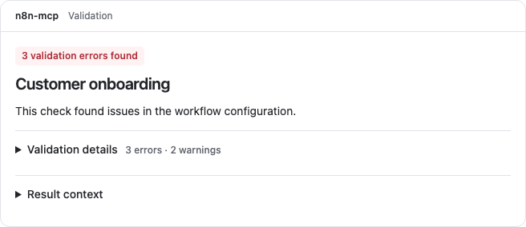
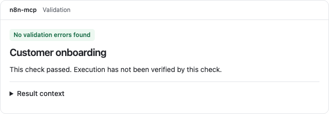
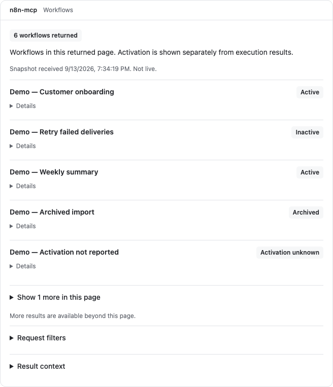
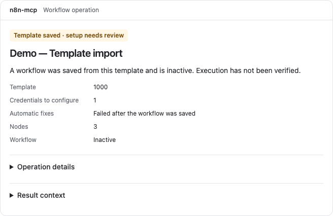
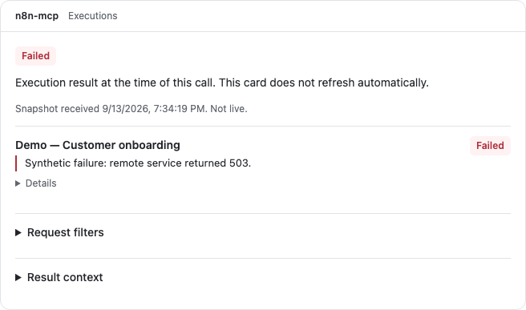
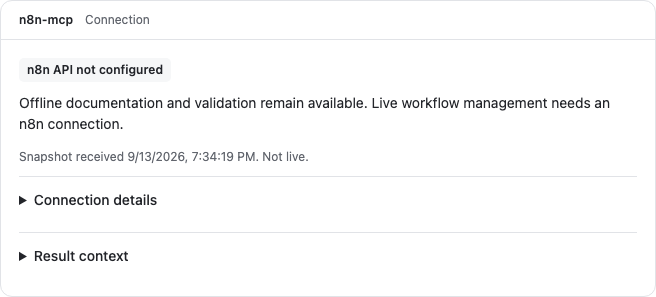

# MCP UI verification — 2026-09-12

Scope: compact operation and validation cards, shared result lifecycle, local SDK host, production-resource smoke, UI dependencies and CI checks. Base commit: `7b9b1c76`; implementation branch: `codex/mcp-ui-agent-supervision`.

The agent remains responsible for building and fixing workflows. Cards expose outcomes and optional inspection details without asking the user to copy repair requests. Public tool response schemas are unchanged. The initial phase preserved dormant registrations; the extension below restores them on the feature branch.

## Results

| Gate | Result |
|---|---|
| Root TypeScript and server build | Passed |
| UI TypeScript and all five production builds | Passed |
| UI component and contract tests | 37 passed |
| Critical result adapters and reducer coverage | 100% lines, statements and functions; 93.85% branches |
| Chromium browser journeys | 4 passed, no retries |
| Accessibility and layout | Automated WCAG A/AA checks, keyboard disclosure, 320px embeds, light/dark host changes passed |
| Real stdio MCP | Tool metadata, both enabled built resources and offline validation passed |
| Production bundles in local SDK host | Both rendered and asserted in Chromium; operation payload explicitly synthetic |
| Repository unit suite | 6,475 passed, 35 skipped; 84.98% lines/statements, 86.60% branches, 85.14% functions |
| Offline integration suite | 501 passed, 16 skipped |
| UI dependency audit | Zero reported vulnerabilities after scoped dependency updates |
| Changed-file secretlint and whitespace checks | Passed |
| Independent review | Four findings fixed; focused follow-up found no remaining consequential issues |

The implementation review used two Terra workers for operation contracts and the local host/testing path, and one Sol worker for correctness/security review and a focused follow-up. The parent integrated changes and ran verification. Fable informed the earlier design consultation; the subsequent agent-led supervision correction came from the user.

## Failures and limits retained

- The initial combined offline coverage run reported 7,036 passing tests, 51 skipped and two failures in the unchanged database performance suite: bulk-insert ratio 26.877 versus a limit of 20, and average query time 62.26ms versus 50ms. Those failures were not hidden with retries or changed thresholds. The repository's intended unit-coverage and single-threaded integration configurations were then run separately; both passed, including the performance tests without coverage instrumentation.
- Early attempts exposed a native SQLite ABI mismatch and sandbox restrictions on local test sockets. Successful repository checks used the installation-compatible Node 22 runtime and permitted local sockets, with live n8n settings empty.
- Live n8n and AI-validation integration directories, Docker suites, and `command-injection-prevention.test.ts` were excluded from the offline integration run. The latter can update the external documentation checkout. No live n8n instance was used.
- `npm run test:e2e` could not run: this checkout contains no tests in its configured `tests/e2e` directory. The new UI browser suite ran separately and passed.
- Real Claude.ai/Desktop and the native ChatGPT desktop application remain unverified. ChatGPT web validation-card results are recorded below. Extended registration and its host acceptance are covered below.
- 200% browser zoom remains a manual acceptance item; the in-app browser did not expose an observable zoom change through the attempted keyboard shortcut. Narrow-layout and keyboard checks passed separately.
- At the end of the initial phase, CI steps had been exercised locally only. Subsequent PR publication and remote CI results are recorded below; no release or live workflow deployment was performed.

Tests changed the bundled database during initialization. Its original tracked contents were restored after the suites completed; no generated database or UI bundle is included in the patch.

## Try it locally

See [the development guide](mcp-ui-development.md) for reproducible commands and the manual acceptance sequence. Start with `npm run ui:dev`, then open `http://127.0.0.1:5173/lab.html`. The lab requires no credentials. Use **Replay agent sequence**, **Load protocol snapshot**, and **Load operation bundle** to inspect the respective paths.

## ChatGPT web host check — 2026-09-13

The local build was connected through an official OpenAI Secure MCP Tunnel and a development plugin. The isolated server exposed seven offline documentation/validation tools with no live n8n configuration. Tunnel liveness and readiness both returned HTTP 200, and ChatGPT discovered the tools and validation template.

- A synthetic workflow containing only a Manual Trigger produced a rendered validation card with one error and zero warnings. Validation details, suggestions, and result context expanded successfully; keyboard activation was also checked.
- The agent then added a connected No Operation node to the in-memory definition and validated it. The next card showed no validation errors and explicitly stated that execution had not been verified. The prior error card retained its original result.
- No workflow was saved, deployed, or executed. This verifies the validation card in ChatGPT web through the built-in browser, not the native desktop application or live operation-result cards.
- ChatGPT displayed its development-mode `CSP off` badge. Widget CSP and a unique widget domain remain submission-readiness work; this test does not establish production submission readiness.
- The minor `1 errors` copy issue was corrected in the extension below. Browser automation encountered fractional iframe coordinate errors; semantic keyboard interaction succeeded, so these were not treated as application failures.

## Restored views — 2026-09-13

Restored workflow lists, execution list/get/delete results, status/diagnostic connection results, and template-deployment receipts on the feature branch. The views use the shared lifecycle boundary, visible snapshot times, bounded initial rows with optional expansion, truthful page scope and strict response adapters. Template receipts distinguish persistence from credential setup, failed autofix and execution. Connection evidence does not infer connectivity from a generic success envelope or expose raw diagnostic environment data.

Verification completed for this extension:

- Root and UI TypeScript, server build and all five UI builds passed. Each built HTML resource is approximately 547–550 kB, below the 750 kB smoke budget.
- 61 UI tests passed; adapter/reducer coverage is 100% lines, statements and functions, 96.43% branches. Tests include mismatched execution action/payload pairs, diagnostic/status mismatches, unknown statuses, invalid dates, endpoint sanitization and post-save template setup failures.
- 54 registry/configuration tests passed. Before PR publication, the complete unit coverage suite was rerun on the final code: 6,475 passed, 35 skipped across 193 files; 84.99% lines/statements, 86.60% branches and 85.14% functions. Real offline stdio smoke returned all five exact built resources and validated a synthetic workflow.
- A separate fixture MCP server passed 15 scenarios across four synthetic tools, exact resource comparisons and mismatched-argument rejection. It performs no live n8n operations.
- Six Chromium journeys passed, including all restored views at 320px, both host themes, accessibility, keyboard expansion and pagination scope. The first attempt at the two new journeys failed because the test selected the implicit label instead of the combobox accessible name; correcting the selector resolved the failures. No retries or relaxed timeouts were added.
- Two Terra reading workers reviewed contracts and legacy UX; one also reviewed the implementation. Follow-up findings led to an in-card synthetic notice and an explicit build-before-fixture command. Fable was consulted once successfully and supported the controlled branch/test approach with visible snapshot context and action-specific rendering; those recommendations were applied.

Extended fixture rendering in ChatGPT passed as recorded below. Native ChatGPT desktop and Claude rendering remain unverified. The historical Claude collapse cause has not been established; synthetic ChatGPT success must not be described as a Claude fix. No release or live workflow deployment was performed.

## Restored views in ChatGPT web — 2026-09-13

After restarting the official tunnel with the isolated fixture server and refreshing the development plugin, ChatGPT discovered four synthetic tools and their four UI templates. All 15 scenarios were called in a single conversation and inspected in the built-in browser using the production HTML resources from commit `032d66b9`.

| View | Scenarios and observed results |
|---|---|
| Workflow list | Empty, request error and six-row page rendered. Active, inactive, archived and unknown activation remained distinct. Expanding the sixth row, row details and request filters worked; the page retained its additional-results notice. |
| Executions | Empty, six-row list, failed execution detail, simulated deletion and request error rendered. Running/waiting statuses were qualified by check time. Expanding the sixth row exposed the unknown status; failure detail showed the synthetic 503 message, execution ID, duration and mode. |
| Connection | Status success, unconfigured diagnostic, configured diagnostic and request error rendered. Details showed the example endpoint, versions, check duration, cache percentage and update availability where supplied. |
| Template receipt | Saved, saved with setup issues and request error rendered. The setup card showed the remaining credential count and failed automatic fixes without losing the saved outcome; optional details exposed the fixture's credential requirements and warning. Neither saved card claimed execution success. |

Each card displayed the in-card synthetic-test notice. The inspection views showed snapshot timestamps and did not present themselves as live monitors. Earlier workflow and execution cards retained their distinct results after later calls. Keyboard disclosure interaction and visual inspection passed. A coordinate-based iframe click was rejected by browser automation because of fractional coordinates; semantic keyboard activation succeeded. Off-screen template cards loaded when scrolled into view.

This is host-rendering evidence for ChatGPT web in development mode, using fixed examples with no live n8n reads, writes, execution or deletion. It does not establish native desktop/Claude compatibility, live management integration, 200% zoom acceptance or app-submission CSP/domain readiness. Host screenshots containing account UI were not added to the public repository; the synthetic local screenshots below remain the public visual references.

Draft [PR #1104](https://github.com/czlonkowski/n8n-mcp/pull/1104) contains the implementation. All executed remote checks for `032d66b9` passed, including the test job, TypeScript/Actions CodeQL, secretlint, fresh-install check, CommonJS runtime and Docker builds. Release creation and the conditional image test were skipped. The unrelated local `data/nodes.db` modification remains excluded.

## Screenshots

These screenshots show built resources rendered in the local SDK lab with synthetic data. They are UI references, not evidence of native desktop-host compatibility.

| Validation error | Validation passed |
|---|---|
|  |  |

| Workflow page | Template setup |
|---|---|
|  |  |

| Execution detail | Connection diagnostic |
|---|---|
|  |  |

## PR review follow-up — 2026-09-13

- Both production Dockerfiles now build UI assets from the UI lockfile in a separate stage and copy the five HTML resources into the runtime. A build-time package smoke checks HTML availability, the 750 kB per-resource budget and all 13 tool metadata mappings. Local UI build output and dependency folders are excluded from the Docker context.
- Fixture calls now reject extra argument keys as well as missing or mismatched values. Protocol smoke covers 15 accepted scenarios, 45 extra/missing-argument cases and the existing mismatched-action case.
- Request filters preserve non-empty string arrays, including tags and node selections, plus pagination cursors and data-selection options. Unsupported workflow-name filtering is no longer presented as a public request option; false and zero values remain visible.
- Root/UI typechecks, server/UI builds, 63 UI tests and six browser journeys passed. Adapter/reducer coverage is 100% lines/statements/functions and 96.48% branches. Both protocol smokes passed. The package smoke passed on a complete isolated artifact and correctly failed when workflow-list HTML was removed. Docker image builds require CI because the local Docker daemon is unavailable.
- The accessibility review's opaque-frame premise was checked against installed AxeBuilder behavior: a deliberately missing-alt image inside the sandboxed local card produced an `image-alt` violation targeting the iframe child. The normal audit already enters that frame; no same-origin relaxation was added. Tests still only assert violations, so incomplete audit results remain a separate limitation.

## Adversarial review fixes — 2026-09-13

The simplifier review (Terra), independent code review (GPT-6), and successful Fable 5.1 xhigh adversarial consultation led to these changes:

- Generic SDK diagnostics no longer terminate the invocation. A communication notice remains visible while waiting; a later valid result replaces it. Initialization failures, tool errors, malformed results and cancellation remain terminal, and completed snapshots remain immutable.
- Loaded UI tools attach `n8n-mcp/toolName` in response metadata. Cards use it before optional host `toolInfo`, preserving operation labels and saved-validation scope when host context omits tool identity. With neither identity source, validation scope is explicitly unreported. Public content and structured schemas are unchanged; hosts still need to forward response metadata or tool context.
- Shared fact markup, explicit inspection-model selection and duration guards remove duplication and nested conditions without changing receipt semantics.
- Root/UI typechecks, server/all five UI builds, 66 UI tests and 87 focused server tests passed. UI model/reducer coverage remains 100% lines, statements and functions. Real stdio smoke verifies response identity and all five built resources; fixture smoke verifies 15 synthetic cases and rejects invalid arguments.
- All eight Chromium journeys passed, including real SDK recovery after an unknown progress token and all seven operation tools without host `toolInfo`. The new warning test initially selected two status elements; its selector now targets the main outcome. No retries or timeout relaxations were introduced.
- The focused root test command initially applied whole-repository coverage thresholds to a subset; all tests passed but the global coverage gate failed. Focused verification was then run with coverage disabled. The previous full unit coverage results above remain the full-suite evidence; this delta awaits its own CI run.
- A final independent review of this delta found no actionable correctness regressions. All executed CI checks for the preceding `6129d41c` commit passed, including the full test job and Docker builds for AMD64, ARM64 and Railway. These earlier CI results do not cover the new review fixes.

This follow-up was tested locally through the real SDK bridge. It does not constitute a new ChatGPT web/native or Claude acceptance run. Restart the local fixture server/tunnel after rebuilding before checking the changed behavior in a chat host.

## npm preparation review fix — 2026-09-13

Copilot identified that the supported local npm preparation script omitted UI assets even though the release workflow packaged them. Both standard and quick preparation now rebuild UI, copy `ui-apps/dist`, whitelist the HTML assets and check the staged registry. CI creates a real npm tarball from each preparation path, extracts it into a temporary directory, checks all five cards and 13 tool mappings, and compares bundled HTML with the build output. The smoke uses an isolated npm cache and never publishes a package.

Both preparation/archive checks passed locally, along with TypeScript, shell/YAML syntax, four bin-consistency tests and all 26 inspection-model tests. A negative test removed UI from the staged files whitelist; the tarball smoke correctly rejected the resulting package. The review's suppressed invalid-URL claim was checked against the source: the fixture contains a valid synthetic HTTPS URL and the credential/path-redaction assertions pass, so it required no change. A separate packaging reviewer identified the quick-script omission and confirmed the extracted registry resolves the correct runtime paths.

All executed CI checks for the preceding `70a1eb15` commit passed. The packaging fix has its own CI run; these earlier results do not cover it.

## Failure-response review fixes — 2026-09-13

The next Copilot review identified two failure-path gaps. Loaded built-in UI tools now include identity metadata in disabled-tool, disabled-operation and execution-error responses as well as normal results. Additional host tools retain their own response format. The result reducer captures identity before decoding, and error cards expose optional result context even when host `toolInfo` is absent. The fixture server mirrors this behavior.

Template deployment now marks non-throwing autofix failure envelopes as `autoFixStatus: failed` and adds a warning to the receipt message, while retaining the successfully saved workflow. A handler regression test uses the real nested autofix call with a mocked post-save read failure; a second test confirms explicitly disabled autofix remains `skipped`.

The existing URL-redaction test already used valid HTTPS. Its fixture now constructs the URL and assigns synthetic credentials separately, making its scheme explicit while preserving credential, path and query-redaction assertions.

Root/UI typechecks, server/all five UI builds, 316 focused server tests, 67 UI tests and eight Chromium journeys passed. Adapter/reducer coverage remains 100% lines/statements/functions and 96.51% branches. Real stdio smoke also confirms identity on an invalid-argument error; all 15 synthetic fixture cases and invalid-argument checks pass. Browser coverage includes an error result with no host `toolInfo` and keyboard-accessible tool context. These changes have not yet been retested in ChatGPT; restart the local server/tunnel before doing so. All executed CI checks for the preceding `b4887c64` commit passed; this delta has its own CI run.

## CI timing-test follow-up — 2026-09-14

CI for `60531daf` passed 6,493 unit tests but failed the pre-existing auth timing test: median runtime variance was 0.605 against a 0.5 threshold under runner load. The test now deterministically verifies that matching tokens and mismatches at either end each invoke the real `crypto.timingSafeEqual` exactly once with the complete UTF-8 buffers. Existing token-result and edge-case assertions remain. Production authentication code is unchanged; no retries or timing-threshold increases were added. This guards use of the crypto primitive and does not claim to prove end-to-end timing behavior from a unit test.

TypeScript and all 13 focused auth tests passed. An initial full-suite sandbox run stopped making progress and was interrupted; the CI-mode run outside the sandbox then passed all 194 files: 6,496 tests passed, 35 skipped, with 85.34% line/statement, 86.45% branch and 85.26% function coverage. No retry setting or coverage threshold was changed.
